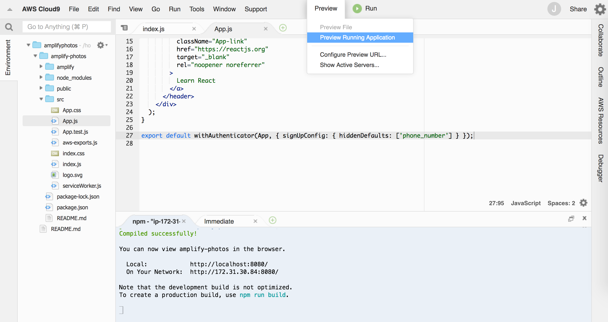
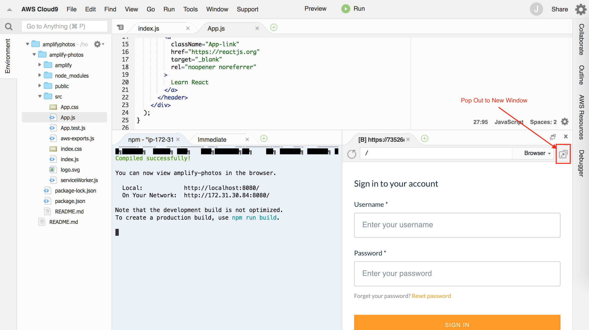
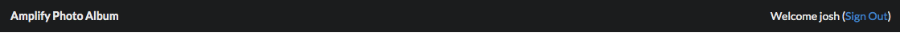

# Build and ship full-stack serverless apps with AWS Amplify

## Adding Authentication

Authentication can be one of the more challenging aspects of building an application. We want to restrict access to our photo album application to authenticated users only.

Amplify provides an [Authentication](https://aws-amplify.github.io/docs/js/authentication) module that allows developers to quickly add authentication capabilities to applications. Amplify uses [Amazon Cognito User Pools](https://docs.aws.amazon.com/cognito/latest/developerguide/cognito-user-identity-pools.html) to manage user registration and authentication. Cognito provides a user directory for our application and can also integrate with Facebook and Google for social sign-in.

To add authentication to our Amplify project, use the following command and follow the prompts:

``` bash
amplify add auth
```

* Do you want to use the default authentication and security configuration? __Default configuration__
* How do you want users to be able to sign in? __Username__
* Do you want to configure advanced settings? __No, I am done.__

While our authentication configuration is basic, the Amplify CLI can also help to customize your sign-in flow to enable 3rd party social providers, customize multi-factor authentication, and more. *Please use the default configuration today.*

Next, we will use the `push` command to update our service configuration and create the Cognito resources in our AWS account. The `amplify add auth` command create a set of CloudFormation templates locally in our project, the `push` command provisions the resources in the cloud.

``` bash
amplify push
```

Amplify will provide an overview of the resources that will be updated as part of the push operation. Here, we can see that we are adding a new Auth resource.

``` bash
Current Environment: dev

| Category | Resource name         | Operation | Provider plugin   |
| -------- | --------------------- | --------- | ----------------- |
| Auth     | amplifyphotosabcde123 | Create    | awscloudformation |
```

* Are you sure you want to continue? __Y__

The `push` command will take a few minutes to run, during which time you will see the updates being made. Amplify will also update `src/aws-exports.js` with details about your new Cognito User Pool. Take a moment to review before moving on.

### Using the withAuthenticator component

Now, we have our user pool configured and provisioned in the cloud, but our React application is not using it yet. We can add authentication to our application with a [Higher-Order Component (HOC)](https://reactjs.org/docs/higher-order-components.html) provided by Amplify.

To add authentication, open __src/App.js__ and import the `withAuthenticator` HOC from `aws-amplify-react`:

``` diff
import React from 'react';
import logo from './logo.svg';
import './App.css';
+ import { withAuthenticator } from 'aws-amplify-react';
```

Next, wrap the default export (the `App` component) with the HOC. Replace the last line in __src/App.js__ as follows:

``` diff
- export default App;
+ export default withAuthenticator(App, { signUpConfig: { hiddenDefaults: ['phone_number'] } });
```

> Note: We are customizing the authenticator to not show the phone number attribute.

Save your changes. Next, let's start the React development server:

``` bash
npm start
```

Once the web server is running, click the "Preview" menu and select "Preview Running Application...".



> If you are using your laptop, open a browser and navigate to http://localhost:3000

Cloud9 will open the application in a browser in a pane in the IDE. You can pop the preview in to a separate window by clicking the marked button.



In the application preview, find the signin form provided by the `withAuthenticator` component.


Select the *Create Account* link and follow the sign up flow to create a new user. Be sure to use an email address you have access to as you will need to confirm the account.

Once you have created a user, you will need to sign in with that user. After signing in, you will find yourself on a React starter page. In future modules, we will replace the boilerplate site.

### Accessing user data

In addition to the Authenticator component used in the previous section, Amplify provides a number of conveniences, including managing security tokens. For our application to function, we will also need access to the name and other information about the currently logged in user.

We are going to leverage a custom React Hook inspired by this [blog post](https://www.rockyourcode.com/custom-react-hook-use-aws-amplify-auth). The Hook listens for changes in authentication state (i.e. sign in) and makes information, such as the currently signed in user's name, available.

> React Hooks are a somewhat new feature that let you use state and other React features without writing a class. While we will use Hooks throughout this workshop, how they work is outside our scope. If you would like to learn more later, visit [Hooks at a Glance](https://reactjs.org/docs/hooks-overview.html) and [Thinking in React Hooks](https://wattenberger.com/blog/react-hooks).

Add a new file in the __src__ directory named __useAmplifyAuth.js__. Copy and paste the following code into the new file.

#### src/useAmplifyAuth.js

``` js
import { useReducer, useState, useEffect } from 'react';
import { Auth, Hub } from 'aws-amplify';

const initalState = {
  isLoading: true,
  error: false,
  user: null
}

function reducer(state, action) {
  switch(action.type) {
    case 'init':
      return { ...state, isLoading: true, error: false }
    case 'success':
      return { ...state, isLoading: false, error: false, user: action.user }
    case 'reset':
      return { ...state, user: null }
    case 'error':
      return { ...state, isLoading: false, error: true }
    default:
      new Error();
  }
}

function useAmplifyAuth() {
  const [state, dispatch] = useReducer(reducer, initalState);
  const [fetchTrigger, setFetchTrigger] = useState(false);

  useEffect(() => {
    let isMounted = true;

    const fetchUser = async () => {
      if (isMounted) {
        dispatch({ type: 'init' });
      }

      try {
        if (isMounted) {
          const authData = await Auth.currentUserInfo();
          if (authData) {
            dispatch({ type: 'success', user: authData });
          }
        }
      } catch (error) {
        if (isMounted) {
          console.error('[ERROR - useAmplifyAuth]', error);
          dispatch({ type: 'error' });
        }
      }
    };

    const HubListener = () => {
      Hub.listen('auth', data => {
        const { payload } = data;
        onAuthEvent(payload);
      });
    };

    const onAuthEvent = (payload) => {
      switch(payload.event) {
        case 'signIn':
          // on signin, we want to rerun effect, trigger via flag
          if (isMounted) { setFetchTrigger(true); }
          break;
        default:
          // ignore anything else
          return;
      }
    };

    HubListener();
    fetchUser();

    // on tear down...
    return () => {
      Hub.remove('auth');
      isMounted = false;
    }
  }, [fetchTrigger]);

  const onSignOut = async () => {
    try {
      await Auth.signOut();
      setFetchTrigger(false);
      dispatch({ type: 'reset' })
    } catch (error) {
      console.error('[ERROR - useAmplifyAuth]', error);
    }
  };

  return { state, onSignOut };
}

export default useAmplifyAuth;
```

Be sure to save the file.

Again, it is not necessary to fully understand the above code. Of note though is the use of the [Amplify Hub](https://aws-amplify.github.io/docs/js/hub) component, which serves as a local eventing system. In this case, we use the Hub to listen for auth events and respond appropriately.

Next, let's update our application to use the new functionality and remove the boilerplate starter page. Open __src/App.js__ and replace its contents with the following:

#### src/App.js

``` js
import React from 'react';
import { Container, Menu } from 'semantic-ui-react';
import { Router, Link } from "@reach/router";

import { withAuthenticator } from 'aws-amplify-react';
import useAmplifyAuth from './useAmplifyAuth';


function App() {
  const { state: { user }, onSignOut } = useAmplifyAuth();

  function UserData(props) {
    return !user ? (
      <div></div>
    ) : (
      <div>Welcome {user.username} (<Link to="/" onClick={onSignOut}>Sign Out</Link>)</div>
    );
  }

  return (
    <div>
      <Menu fixed='top' borderless inverted>
        <Container>
          <Menu.Item as={Link} to='/' header>
            Amplify Photo Album
          </Menu.Item>

          <Menu.Menu position='right'>
            <Menu.Item>
              <UserData></UserData>
            </Menu.Item>
          </Menu.Menu>
        </Container>
      </Menu>

      <Container text style={{ marginTop: '5em' }}>
        <p>To be updated...</p>
      </Container>    
    </div>
  );
}

export default withAuthenticator(App, { signUpConfig: { hiddenDefaults: ['phone_number'] } });
```

> It is safe to ignore the `no-unused-vars` warning.

After saving the file and waiting a moment for the project to build, go back to your browser and refresh. You should now see a page with a black header -- on the right side of that header, you should see "Welcome <your username>" as seen below:



Stop the React dev server by pressing `Ctrl+C` in the terminal.

In the next module, we will add storage to our application.

**[Adding Storage >>](../2_Storage)**
