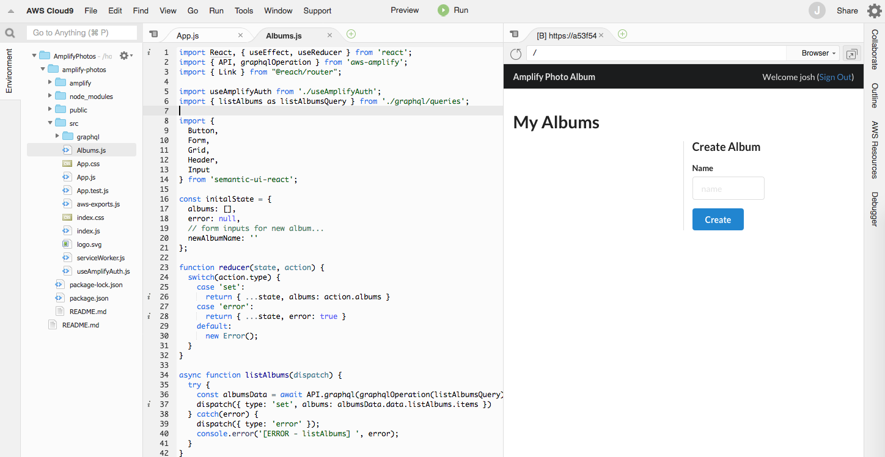
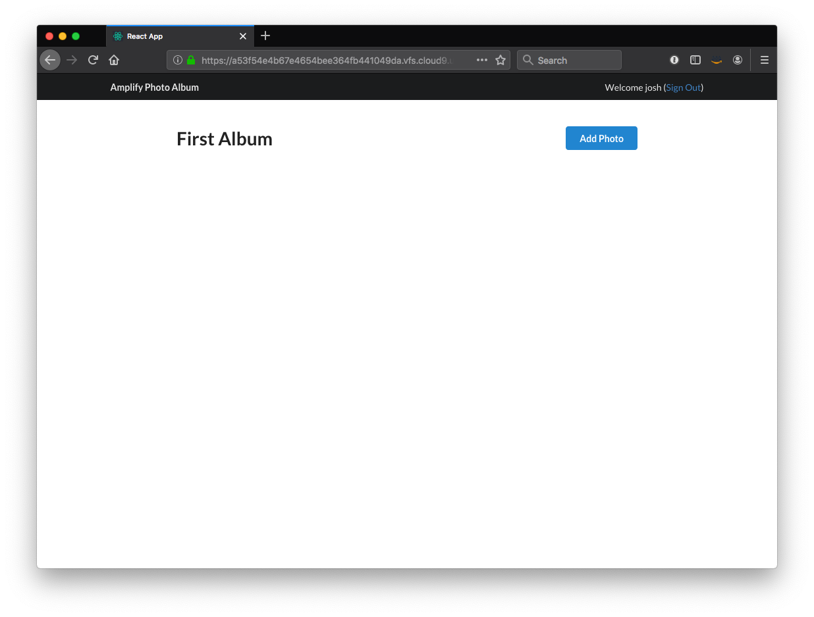

# Build and ship full-stack serverless apps with AWS Amplify

## Integrating React Application and GraphQL API

In this section, you will incorporate the newly created GraphQL API in to the React application created earlier. At the end of this module, the application will support creation and loading of dynamic data.

To begin our application updates, modify `src/App.js` in two places. First, add a new import for the (to-be-created) Albums component (you can ignore any error messages for now).

``` diff
import useAmplifyAuth from './useAmplifyAuth';
+ import Albums from './Albums';
```

Second, replace placeholder body content with a router that defines the various pages our React application can navigate to:

``` diff
<Container text style={{ marginTop: '5em' }}>
-   <p>To be updated...</p>
+   <Router>
+     <Albums path='/' />
+   </Router>
</Container>
```

Save the file and create a new file in `src/` named `Albums.js` with the following contents:

#### src/Albums.js

``` js
import React, { useEffect, useReducer } from 'react';
import { Button, Form, Grid, Header, Input } from 'semantic-ui-react';
import { API, graphqlOperation } from 'aws-amplify';
import { Link } from "@reach/router";

import { listAlbums as listAlbumsQuery } from './graphql/queries';

const initalState = {
  albums: [],
  error: null,
  // form inputs for new album...
  newAlbumName: ''
};

function reducer(state, action) {
  switch(action.type) {
    case 'set':
      return { ...state, albums: action.albums }
    case 'error':
      return { ...state, error: true }
    default:
      new Error();
  }
}

async function listAlbums(dispatch) {
  try {
    const albumsData = await API.graphql(graphqlOperation(listAlbumsQuery));
    dispatch({ type: 'set', albums: albumsData.data.listAlbums.items })
  } catch(error) {
    dispatch({ type: 'error' });
    console.error('[ERROR - listAlbums] ', error);
  }
}

async function createAlbum(user, state, dispatch) {
}

function update(value, inputValue, dispatch) {
}

function AlbumList(props) {
  return (
    <ul>
      {
        props.albums.map((album, i) => (
          <li key={i}>
            <Link to={'/album/' + album.id}>{album.name}</Link>
          </li>
        ))
      }
    </ul>
  );
}

function Albums({ user }) {
  const [state, dispatch] = useReducer(reducer, initalState);

  useEffect(() => {
    listAlbums(dispatch)
  }, []);

  return (
    <div>
      <Header as='h1'>My Albums</Header>

      <Grid divided>
        <Grid.Row>
          <Grid.Column width={8}>
            <AlbumList albums={state.albums} />
          </Grid.Column>

          <Grid.Column width={4}>
            <Header as='h3'>Create Album</Header>

            <Form>
              <Form.Field>
                <label>Name</label>
                <Input placeholder='name'
                  onChange={ e => update(e.target.value, 'newAlbumName', dispatch) }
                  value={ state.newAlbumName } />
              </Form.Field>
              <Button primary onClick={() => createAlbum(user, state, dispatch)}>
                Create
              </Button>
            </Form>
          </Grid.Column>
        </Grid.Row>
      </Grid>
    </div>
  )
};

export default Albums;
```

Save the file. After a few moments, if you return to your browser, you should see the following.



At this point, our application is performing a query to fetch data from AppSync, but there are no albums yet. The album we created earlier was in the mock environment. That said, the GraphQL query used to fetch data in this component is called `listAlbums` and can be found in `src/graphql/queries.js`. Take a moment to open the file and find the `listAlbums` query.

> We use the [useReducer](https://reactjs.org/docs/hooks-reference.html#usereducer) React Hook to manage our component state. We'll add additional cases to the `userReducer` hook shortly.

#### Performing mutations

Now, let's enhance the application to support creation of new albums.

Open the file `src/Albums.js`. We will modify it in two places, as described below. First, we will import the GraphQL mutation needed to create a new album. The mutation can be found in `src/graphql/mutations.js` and is named `createAlbum`.

``` diff
import { listAlbums as listAlbumsQuery } from './graphql/queries';
+ import { createAlbum as createAlbumMutation } from './graphql/mutations';
```

Next, let's enhance our reducer function in `src/Albums.js` to manage the additional state required for the mutation. This includes adding support for handling form data. The reducer is a somewhat special function that is used here to manage the state of data in the React component based on an event or action.

``` diff
function reducer(state, action) {
  switch(action.type) {
    case 'set':
      return { ...state, albums: action.albums }
+    case 'input':
+      return { ...state, [action.inputValue]: action.value }  
+    case 'reset':
+      return { ...state, [action.inputValue]: '' }
    case 'error':
      return { ...state, error: true }
    default:
      new Error();
  }
}
```

Now, add the bodies of the `createAlbum` and `update` functions. These are called when the user clicks the "Create" button and as form data is entered, respectively. Note that we use the `dispatch` function to call our reducer, passing an action type and changes to state.

In the `createAlbum` function, we will also use the Amplify API class again. In addition to passing the GraphQL mutation, we will now also pass a second argument to pass variables.

``` diff
async function createAlbum(user, state, dispatch) {
+   const { newAlbumName } = state;
+   const newAlbum = {
+     name: newAlbumName,
+     owner: user.username,
+     ownerId: user.id
+   }

+   try {
+     await API.graphql(graphqlOperation(createAlbumMutation, { input: newAlbum }));
+     dispatch({ type: 'reset' });
+     console.log('New album created');
+   } catch (error) {
+     dispatch({ type: 'error' });
+     console.error('[ERROR - createAlbum] ', error);
+   }
}

function update(value, inputValue, dispatch) {
+   dispatch({ type: 'input', value, inputValue });
}
```

After saving the updates, jump back to the browser. Create a new album by entering a name (e.g. "First Album") and clicking the "Create" button. In your browser's Developer Tools Console, you should see the message "New album created". If you refresh the page, you should see the new album, though that is not ideal, we want the album to immediately appear locally when the album is created. We will use a GraphQL Subscription to update the page.

#### Adding subscriptions

Next, let's add a subscription to the application to listen for changes in our data.

To do so, we need to define the subscription, listen for the subscription, & update the state whenever a new piece of data comes in through the subscription. In `src/Albums.js`, we will import the GraphQL subscription generated by Amplify, enhance our reducer, and add a few lines of code to subscribe.

``` diff
import useAmplifyAuth from './useAmplifyAuth';
import { listAlbums as listAlbumsQuery } from './graphql/queries';
import { createAlbum as createAlbumMutation } from './graphql/mutations';
+ import { onCreateAlbum } from './graphql/subscriptions';
```

Subscriptions generated by Amplify can be found in `src/graphql/subscriptions.js`. Take a moment to review the `onCreateAlbum` GraphQL.

Next, update the reducer function to update component state when new data arrives from the subscription.

``` diff
function reducer(state, action) {
  switch(action.type) {
    case 'set':
      return { ...state, albums: action.albums }
+     case 'add':
+       return { ...state, albums: [ ...state.albums, action.album ] }
    case 'input':
      return { ...state, [action.inputValue]: action.value }  
    case 'reset':
        return { ...state, [action.inputValue]: '' }
    case 'error':
      return { ...state, error: true }
    default:
      new Error();
  }
}
```

Add a new `useEffect` Hook to the Albums component. This is where we will actually subscribe to changes in data, specifically the `onCreateAlbum` subscription. When new data arrives, we call the reducer to append the new album to the component state.

``` diff
function Albums({ user }) {
  const [state, dispatch] = useReducer(reducer, initalState);

+   useEffect(() => {
+      if (!user) { return; }
+        const { username } = user;
+        const subscription = API.graphql(graphqlOperation(onCreateAlbum, { owner: username })).subscribe({
+           next: (data) => {
+             const album = data.value.data.onCreateAlbum;
+             dispatch({ type: 'add', album });
+           }
+         });
+ 
+     return () => {
+       subscription.unsubscribe();
+     }
+   }, [user]);

  useEffect(() => {
    listAlbums(dispatch)
  }, []);
```

Save your changes. Return to the browser, refresh, and create another new album (i.e. "Second Album"). In addition to the same messsage as earlier in the Developer Tools Console, the interface should also update to display both albums that you have created.

We have now used all three operations provided by GraphQL: queries, mutations, and subscriptions. GraphQL allows us to build a rich client application with real-time data.

### Adding album detail

Before we build other aspects of our application, let's add a second component that displays details of an album.

First, update `src/App.js` to include the new component and route. This will require two changes:

``` diff
import { withAuthenticator } from 'aws-amplify-react';
import useAmplifyAuth from './useAmplifyAuth';
import Albums from './Albums';
+ import AlbumDetail from './AlbumDetail';
```

Further down the page, add the new route:

``` diff
      <Container text style={{ marginTop: '5em' }}>
        <Router>
          <Albums path='/' user={ user } />
+         <AlbumDetail path='/album/:albumId' user={ user } />
        </Router>
      </Container> 
```

Save `src/App.js`. You can safely ignore the "Module not found" error.

Next, create a new file at `src/AlbumDetail.js` with the following content. Take a moment to review the newly created component before moving on.

#### src/AlbumDetail.js

``` js
import React, { useEffect, useState, useReducer } from 'react';
import { Button, Card, Header, Icon, Image, Message, Modal } from 'semantic-ui-react';
import { API, Storage, graphqlOperation } from 'aws-amplify';
import { S3Image, PhotoPicker } from 'aws-amplify-react';
import awsconfig from './aws-exports';
import uuid from 'uuid/v4';

import { getAlbum as getAlbumQuery } from './graphql/queries';
import { createPhoto as createPhotoMutation } from './graphql/mutations';

function PhotoCard(props) {
  const [src, setSrc] = useState('');
  const { fullsize } = props.photo;

  return (
    <Card>
      <S3Image hidden level='protected' imgKey={ fullsize.key } onLoad={ url => setSrc(url) } />
      <Image src={ src } />
    </Card>
  );
}

function PhotoGrid(props) {
  return (
    <Card.Group itemsPerRow={3}>
      {
        props.photos.map((photo, i) => (
          <PhotoCard key={ i } photo={ photo } />
        ))
      }
    </Card.Group>
  );
}

function AlbumDetail({ albumId, user }) {
  const {
    aws_user_files_s3_bucket_region: region,
    aws_user_files_s3_bucket: bucket
  } = awsconfig;
  
  const initalState = {
    album: {},
    photos: [],
    isLoading: false,
    message: '',
    error: null
  };

  const [openModal, showModal] = useState(false);
  const [state, dispatch] = useReducer(reducer, initalState);

  // add subscription for new photos in this album

  useEffect(() => {
    dispatch({ type: 'init' });
    getAlbum(albumId, dispatch);
  }, [albumId]);
  
  function reducer(state, action) {
    switch(action.type) {
      case 'init':
        return { ...state, isLoading: true };
      case 'set':
        return { 
          ...state,
          isLoading: false,
          album: action.album,
          photos: action.album.photos.items ? action.album.photos.items : []
        };
      case 'message':
        return { ...state, message: action.message };
      case 'error':
        return { ...state, error: true };
      default:
        new Error();
    }
  }
  
  async function getAlbum(albumId, dispatch) {
    try {
      const albumData = await API.graphql(graphqlOperation(getAlbumQuery, { id: albumId }));
      dispatch({ type: 'set', album: albumData.data.getAlbum });
    } catch (error) {
      dispatch({ type: 'error' });
      console.error('[ERROR - getAlbum] ', error);
    } 
  }
  
  async function createPhoto(data, state, dispatch) {
    if (data && data.file) {
      const { file, type: mimeType } = data;
      const extension = file.name.substr((file.name.lastIndexOf('.') + 1));
      const photoId = uuid();
      const key = `images/${photoId}.${extension}`;
  
      const inputData = {
        id: photoId,
        photoAlbumId: state.album.id,
        contentType: mimeType,
        fullsize: {
          key: key,
          region: region,
          bucket: bucket
        }
      };
  
      try {
        await Storage.put(key, file, { level: 'protected', contentType: mimeType, metadata: { albumId: state.album.id, photoId } });
        await API.graphql(graphqlOperation(createPhotoMutation, { input: inputData }));
        console.log(`Successfully created photo - ${photoId}`);
        dispatch({ type: 'message', message: 'New photo created successfully' });
        showModal(false);
      } catch(error) {
        console.error('[ERROR - createPhoto] ', error);
      }
    }
  }

  return state.isLoading ? (
    <p>loading...</p>
  ) : (
    <div>
      <Modal size='small' closeIcon
             open={openModal}
             onClose={() => { showModal(false) }}
             trigger={<Button primary floated='right' onClick={() => {showModal(true) }}>Add Photo</Button>}>
        <Modal.Header>Upload Photo</Modal.Header>
        <Modal.Content>
          <PhotoPicker preview onPick={(data) => createPhoto(data, state, dispatch)} />
        </Modal.Content>
      </Modal>
    
      <Header as='h1'>{ state.album.name }</Header>
      { state.message &&
        <Message><p>{ state.message }</p></Message> }
      <PhotoGrid photos={ state.photos } />
    </div>
  );
}

export default AlbumDetail;
```

After saving the file, return to the browser (it's safe to ignore unused warnings). Click on the name of the first album to view the detail page.



Click the "Add Photo" button in the upper right. Select a photo. After a few moments, you will see the message "New photo created successfully". Close the modal photo picker by clicking the close icon or the dark background just behind the modal. Refresh the page to see the newly uploaded photo. Like with albums, we could add a subscription to this component to display newly created photos, but will leave that for an exercise outside of the workshop.

In the next module, we will build a Lambda function that will be triggered on each photo upload.

**[Adding a Lambda Trigger >>](../4_Trigger)**
