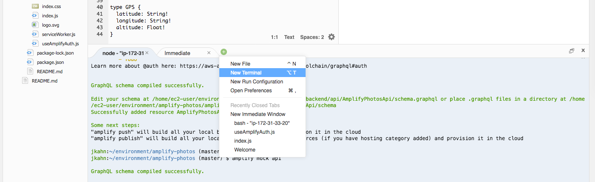
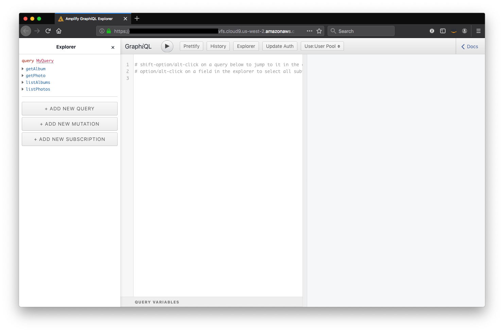
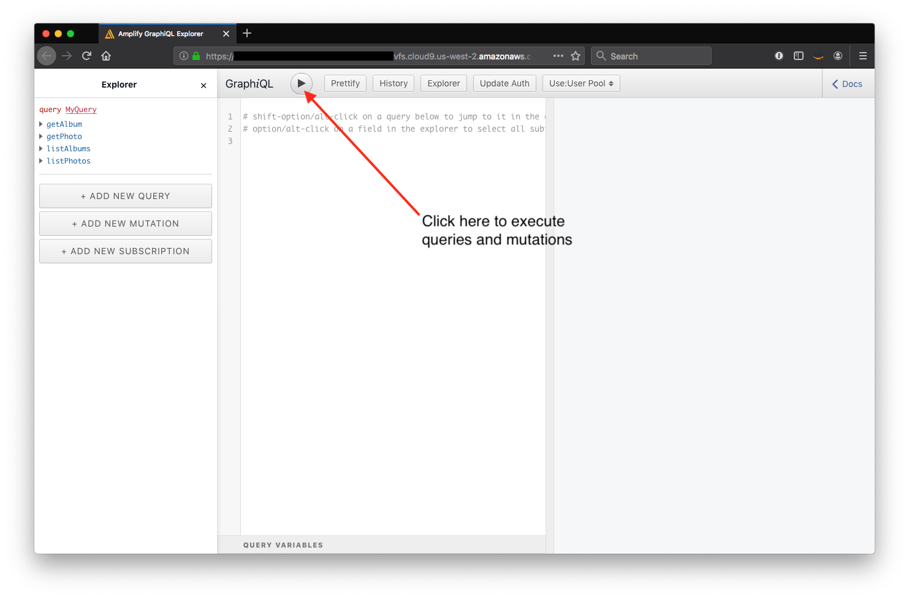

# Build and ship full-stack serverless apps with AWS Amplify

## Adding a GraphQL API

In this module, we will add a GraphQL API to provide data to our photo album application. The API will be powered by [AWS AppSync](https://aws.amazon.com/appsync/), an AWS managed service that makes it easy for applications to get exactly the data they need. The [Amplify API](https://aws-amplify.github.io/docs/js/api) module makes it easy to setup and use GraphQL APIs.

To get started, we'll add the API to our Amplify project. Amplify offers a number of sample schemas, we will pick one and replace it with a custom schema. Run the following command and follow the prompts:

``` bash
amplify add api
```

* Please select from one of the below mentioned services __GraphQL__
* Provide API name: __AmplifyPhotosApi__
* Choose an authorization type for the API __Amazon Cognito User Pool__
* Do you want to configure advanced settings for the GraphQL API __Yes, I want to make some additional changes.__
* Choose the additional authorization types you want to configure for the API __IAM__
* Do you have an annotated GraphQL schema? __No__
* Do you want a guided schema creation? __Yes__
* What best describes your project: __Single object with fields (e.g., “Todo” with ID, name, description)__
* Do you want to edit the schema now? __No__

A GraphQL schema describes the shape of data and functionality available in a GraphQL API. For more details on GraphQL schema, see [graphql.org](https://graphql.org/learn/schema/).

Open the schema at `amplify/backend/api/AmplifyPhotosApi/schema.graphql` and replace the entire contents of the existing Todo schema with the following. Be sure to save it.

``` graphql
type Album
  @model
  @auth(rules: [{ allow: owner }])
{
  id: ID!
  owner: ID!
  ownerId: String!
  name: String!
  createdAt: String
  updatedAt: String
  photos: [Photo] @connection(name: "AlbumPhotos", sortField: "createdAt")
}

type Photo
  @model
  @auth(
    rules: [
      { allow: owner },
      { allow: private, provider: iam, operations: [ read, update ] }
    ]
  )
{
  id: ID!
  createdAt: String
  updatedAt: String
  album: Album @connection(name: "AlbumPhotos", sortField: "createdAt")
  fullsize: S3Object!
  thumbnail: S3Object
  contentType: String
  gps: GPS
  height: Int
  width: Int
}

type S3Object @aws_iam @aws_cognito_user_pools {
  region: String!
  bucket: String!
  key: String!
}

type GPS {
  latitude: String!
  longitude: String!
  altitude: Float!
}
```

Amplify includes a [GraphQL Transform](https://aws-amplify.github.io/docs/cli-toolchain/graphql) feature that helps to quickly create AWS resources based on the data model defined in the schema. Directives such as `@model` and `@auth` are converted by Amplify to [AWS CloudFormation](https://aws.amazon.com/cloudformation/) templates that implement the data model. For example, objects annotated with `@model` are stored in [Amazon DynamoDB](https://aws.amazon.com/dynamodb/) and can be related to other objects via `@connection`.

For this project, we have used three directives:

* `@model` - top level entities in the API, stored in DynamoDB. Generates DynamoDB, AppSync Data Source, and other applicable resources.
* `@auth` - annotated objects are protected by a set of authorization rules. Generates snippets of AppSync resolvers to enable authorization. Here, we primarily only allow the owner of an object to modify it. In the case of photos, we also want to allow a Lambda function to modify data and provide AWS IAM permissions to read / update that data.
* `@connection` - enables a relationship between multiple objects annotated by `@model`. Generates DynamoDB Global Secondary Indexes (GSI) to keep queries fast and efficient.

### Local mocking and testing

Amplify provides a rich mocking capability. Instead of creating and using resources in the cloud, we will emulate those services locally using the `amplify mock` command. Mocking locally allows us to test changes quickly, without the need to provision or update on each iteration. Note that while mocking is powerful, it does not support the full behavior of all resources.

To test our GraphQL API, run the mock command:

``` bash
amplify mock api
```

* Choose the code generation language target: __javascript__
* Enter the file name pattern of graphql queries, mutations and subscriptions: __src/graphql/**/*.js__
* Do you want to generate/update all possible GraphQL operations - queries, mutations and subscriptions: __Y__
* Enter maximum statement depth [increase from default if your schema is deeply nested]: __5__

Amplify provides a GraphQL Editor based on the open source [OneGraph graphiql-explorer](https://github.com/OneGraph/graphiql-explorer) plugin. The IDE allows us to test various GraphQL operations, but remember, changes made here are stored in a local database, not in your project's actual DynamoDB tables.

#### Opening GraphQL Editor on Cloud9

To access the GraphQL Editor on Cloud9, we will run an nginx proxy server to allow access on port 8080 (Cloud9 only allows preview of local applications on a small number of ports). We can setup the proxy in a few commands. 

We can leave the GraphQL mock server running by clicking the "+" button and selecting "New Terminal" as shown below.



Then, enter the following commands in the new terminal:

``` bash
sudo yum install nginx -y
```

``` bash
echo "server {
  listen 8080;
  location / {
    proxy_pass http://127.0.0.1:20002;
  }
}" | sudo tee -a /etc/nginx/conf.d/virtual.conf > /dev/null
```

``` bash
sudo service nginx start
```

Next, click the "Preview" menu and select "Preview Running Application..." (yes, we did this previously, but need to do again for the nginx application). Use the Popout New Window button to open the preview in a browser tab. You should now see the GraphQL IDE as shown below:



### Mutations in the local environment

Our application currently has no data. Let's start by creating a new Album. Enter the following GraphQL mutation in the left panel of the IDE. Click the "Play" button at the top of the page.

``` graphql
mutation CreateAlbum {
  createAlbum(input: { owner: "user1", ownerId: "abc1234", name: "My First Album" })
  {
    id
  }
}
```



The result should be similar to:

``` json
{
  "data": {
    "createAlbum": {
      "id": "5221c839-aeb5-42f2-9206-a5f2864d38f5"
    }
  }
}
```

Next, create a photo in the album by replacing the previous mutation.

> NOTE: Replace the album ID shown below with the ID found in the result of the previous query.

``` graphql
mutation CreatePhoto {
  createPhoto(input: {
      photoAlbumId: "<INSERT ALBUM ID FROM PREVIOUS STEP>",
      fullsize: { region: "us-east-1", bucket: "my-bucket", key: "photo1" }
    })
  {
    id
    owner
  }
}
```

The result should look similar to the following:

``` json
{
  "data": {
    "createPhoto": {
      "id": "12a7de6f-9595-453d-98e5-beee0facc3c8",
      "owner": "user1"
    }
  }
}
```

### Queries in the local environment

Next, we can query for data using a GraphQL query. Replace the earlier contents with the following and click the "Play" button:

``` graphql
query MyQuery {
  listAlbums {
    items {
      id
      name
    }
  }
}
```

This query would result in the following response:

``` json
{
  "data": {
    "listAlbums": {
      "items": [
        {
          "id": "5221c839-aeb5-42f2-9206-a5f2864d38f5",
          "name": "My First Album"
        }
      ]
    }
  }
}
```

One of the powerful aspects of GraphQL is that the client can ask for different data fields depending on the need. For example, we may want to include a photo from each album in the listing as opposed to just the album name. When using a REST API, this would likely necessitate an additional query _per album_ on the page to get album details. In GraphQL, we can compose the following:

``` graphql
query ListAlbums {
  listAlbums {
    items {
      id
      name
      photos(limit: 1) {
        items {
          id
          createdAt
          fullsize {
            key
          }
        }
      }
    }
  }
}
```

Amplify's `@connection` directive also adds several filtering options to the nested object in our query. In this case, we'll limit the number of photos returned to one. The result of the query is as follows:

``` json
{
  "data": {
    "listAlbums": {
      "items": [
        {
          "id": "5221c839-aeb5-42f2-9206-a5f2864d38f5",
          "name": "My First Album",
          "photos": {
            "items": [
              {
                "id": "62aef3cd-9fb0-4c64-8ce3-d97ff0729e3d",
                "createdAt": "2019-09-04T02:37:25.068Z"
              }
            ]
          }
        }
      ]
    }
  }
}
```

Feel free to explore other mutations and queries available in the existing GraphQL schema. As you can see, Amplify has done a lot of heavy lifting for us.

> Curious to review the complete schema generated by Amplify? Open `amplify/backend/api/AmplifyPhotosApi/build/schema.graphql` in your IDE.

We are finished working with the nginx proxy and Amplify mock server. Return to the first terminal tab and press "Ctrl+C", then enter the following command to stop the proxy:

``` bash
sudo service nginx stop
```

Now that we have briefly explored the GraphQL API, let's provision the AppSync and S3 (created in previous module) resources in AWS using the `push` command:

``` bash
amplify push
```

The status of your resources should look as follows. Follow the prompts as shown below.

``` bash
| Category | Resource name         | Operation | Provider plugin   |
| -------- | --------------------- | --------- | ----------------- |
| Storage  | AmplifyPhotoStorage   | Create    | awscloudformation |
| Api      | AmplifyPhotosApi      | Create    | awscloudformation |
| Auth     | amplifyphotosabcde123 | No Change | awscloudformation |
```

* Are you sure you want to continue? __Y__
* Do you want to update code for your updated GraphQL API __N__

Once Amplify finished provisioning resources, start the React development server again:

``` bash
npm start
```

Click the "Preview" menu and select "Preview Running Application..." once again. Our application is now ready to utilize the newly created GraphQL API. While we have only touched on the capabilities of AWS AppSync, we have enough to begin to build our application user interface.

Next, you will update the frontend application to incorporate the new GraphQL API.

**[Integrating React Application and GraphQL API >>](./AppDev.md)**