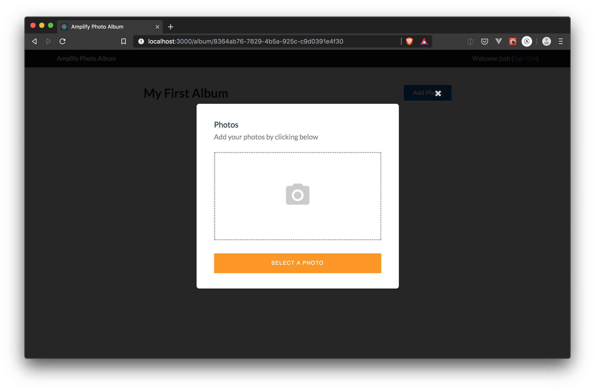

# Build and ship full-stack serverless apps with AWS Amplify

## Adding a Lambda Trigger

Amplify supports Amazon S3 and DynamoDB triggers. This means you can invoke a Lambda function on create, update, and/or delete events from these sources. For our application, we will trigger a processing function whenever a new photo is uploaded to the storage bucket. The function will create a thumbnail version of the photo as well as capture and store [EXIF data](https://photographylife.com/what-is-exif-data), if available, from the photo.

To get started, let's create a new Lambda function that will be triggered when a new photo is uploaded. Enter the following command in the second terminal tab (you can leave the React dev server running in the first tab):

``` bash
cd amplify-photos
```

``` bash
amplify add function
```

* Provide a friendly name for your resource to be used as a label for this category in the project: __AmplifyPhotoProcessor__
* Provide the AWS Lambda function name: __AmplifyPhotoProcessor__
* Choose the function template that you want to use: __Hello world function__
* Do you want to access other resources created in this project from your Lambda function? __Yes__
* Select the category __api__
* Select the operations you want to permit for AmplifyPhotosApi __read__
* Do you want to edit the local lambda function now? __No__

> TIP: Use the space bar to select `api` and `read` in the steps above. If these are not selected, your function will not work properly.

Next, add a few dependencies for the function to enable image manipulation, read EXIF data, and to call AppSync:

``` bash
cd amplify/backend/function/AmplifyPhotoProcessor/src
```

``` bash
npm install axios aws4 exif-reader --save
```

``` bash
# install a pre-built version of Sharp for linux
npm install --arch=x64 --platform=linux --target=10.15.0 sharp --save
```

Next, we will replace the boilerplate function with our photo processing code. The new function will (1) generate a thumbnail of the original image and (2) extract EXIF data (specifically geolocation) from the image file, when available.

Open `amplify/backend/function/AmplifyPhotoProcessor/src/index.js` and replace the contents with the following, leaving the Amplify Params comment block at the top. The details of the function are beyond the scope of this workshop, but we have included comments in the code that describe the core functionality.

#### amplify/backend/function/AmplifyPhotoProcessor/src/index.js

``` js
const AWS = require('aws-sdk');
const axios = require('axios');
const aws4 = require('aws4');
const urlParse = require('url').URL;
const sharp = require('sharp');
const exifReader = require('exif-reader');

const appSyncUrl = process.env.API_AMPLIFYPHOTOSAPI_GRAPHQLAPIENDPOINTOUTPUT;
const appSyncHost = new urlParse(appSyncUrl).hostname.toString();

const THUMBNAIL_WIDTH = 300;
const THUMBNAIL_HEIGHT = 300;

let s3Client = null;

//
// Load image from S3 by passing bucket and key.
//
async function loadImage(bucket, key) {
  const params = { Bucket: bucket, Key: key }
  return await s3Client.getObject(params).promise()
}

//
// Resize image to thumbnail and convert to JPEG; then put put in S3.
//
async function createThumbnail(bucket, key, image) {
  const thumbKey = key.replace('images', 'thumbs').replace(/\.[^\.]+$/, '.jpg');

  try {
    // Use Sharp to resize the image to and convert to JPEG format
    let thumb = await sharp(image)
                        .resize(THUMBNAIL_WIDTH, THUMBNAIL_HEIGHT)
                        .jpeg()
                        .toBuffer();
              
    await s3Client.putObject({ Bucket: bucket, Key: thumbKey, Body: thumb }).promise();
    return {
      bucket: bucket,
      key: thumbKey.substring(thumbKey.indexOf('thumbs')),
      region: process.env.REGION
    };
  } catch (error) {
    console.error('[createThumbnail] ', error);
    throw error;
  }
}


//
// Retrieve metadata and EXIF data from image.
//
async function getPhotoMetadata(image) {
  try {
    const metadata = await sharp(image).metadata();

    let result = {
      height: metadata.height,
      width: metadata.width
    };

    const gps = getGpsData(metadata);
    if (gps) { result['gps'] = gps; }
    return result;
  } catch (error) {
    console.error('[storeExifData] ', error);
    return null;
  }
}

//
//
//
function getGpsData(metadata) {
  let result = null;

  try {
    const gps = exifReader(metadata.exif).gps;
    result = {
        latitude: `${gps.GPSLatitude[0]}°${gps.GPSLatitude[1]}'${gps.GPSLatitude[2]}"${gps.GPSLatitudeRef}`,
        longitude: `${gps.GPSLongitude[0]}°${gps.GPSLongitude[1]}'${gps.GPSLongitude[2]}"${gps.GPSLongitudeRef}`,
        altitude: gps.GPSAltitude
    }
  } catch (error) {
    console.warn('Failed to get EXIF data, may not exist');
  }

  return result;
}

//
// GraphQL mutation to update photo record properties.
//
const updatePhotoMutation =
`mutation UpdatePhoto($input: UpdatePhotoInput!) {
  updatePhoto(input: $input) {
    id
    createdAt
    updatedAt
    gps {
      latitude
      longitude
      altitude
    }
    thumbnail {
      key
    }
  }
}`;

//
// Store thumbnail and metadata via AppSync.
//
async function updatePhotoRecord(photoId, metadata, thumbnail) {
  let mutation = {
    query: updatePhotoMutation,
    operationName: 'UpdatePhoto',
    variables: {
      input: {
        id: photoId,
        ...metadata,
        thumbnail
      }
    }
  };

  let request = aws4.sign({
    method: 'POST',
    url: appSyncUrl,
    host: appSyncHost,
    path: '/graphql',
    headers: {
      'Content-Type': 'application/json'
    },
    service: 'appsync',
    data: mutation,
    body: JSON.stringify(mutation)
  });
  delete request.headers['Host'];
  delete request.headers['Content-Length'];

  let result = await axios(request);
  console.log(JSON.stringify(result.data));
  if (result.errors && result.errors.length > 0) {
    console.error(`[updatePhotoRecord] ${result.errors[0].message}`);
    throw new Error(`AppSync error - ${result.errors[0].errorType}: ${result.errors[0].message}`);
  }
}

//
// Main handler for Lambda function.
//
exports.handler = async (event) => {
  const bucket = event.Records[0].s3.bucket.name; //eslint-disable-line
  const key = decodeURIComponent(event.Records[0].s3.object.key.replace(/\+/g, " ")); //eslint-disable-line

  if (key.indexOf('thumb') > 0) { return { status: 'skipped', key }; }

  if (!s3Client)  { s3Client = new AWS.S3() }

  try {
    let image = await loadImage(bucket, key);

    // create a thumbnail of the original image and store in S3
    // and capture metadata from original photo - take advantage of parallelism
    let [thumb, metadata] = await Promise.all([
        createThumbnail(bucket, key, image.Body),
        getPhotoMetadata(image.Body)
      ]);

    // finally, update the record in DynamoDB via AppSync
    await updatePhotoRecord(image.Metadata.photoid, metadata, thumb);
  } catch (error) {
    console.error(JSON.stringify(error));
    console.error('An error occurred');
    return error;
  }

  return { status: 'complete', key };
};
```

Be sure to save the file before moving on.

With the function code written, we will configure the Lambda function to be invoked when new photos are put in the storage bucket. (Note: we could have also configured the trigger when adding storage earlier as well)

``` bash
cd ~/environment/amplify-photos
```

``` bash
amplify storage update
```

* Please select from one of the below mentioned services __Content (Images, audio, video, etc.)__
* Who should have access: __Auth users only__
* What kind of access do you want for Authenticated users? __create/update, read, delete__
* Do you want to add a Lambda Trigger for your S3 Bucket? __Yes__
* Select from the following options __Choose an existing function from the project__
* Select from the following options __AmplifyPhotoProcessor__

### Tweaking function configuration

We need to tweak the CloudFormation template generated by Amplify for the `AmplifyPhotoProcessor` function. Because our function deals with image manipulation, we are going to increase memory provided to the function. We are also going to modify the execution policy of the function to allow it to run GraphQL operations.

Open the CloudFormation template at `amplify/backend/function/AmplifyPhotoProcessor/AmplifyPhotoProcessor-cloudformation-template.json` and carefully make the following changes:

``` diff
"Runtime": "nodejs10.x",
+ "MemorySize": 1536,
"Timeout": "25"
```

And

``` diff
"Effect": "Allow",
"Action": [
- "appsync:Get*"
- "appsync:List*"            
+ "appsync:GraphQL"
],
"Resource": [
```

### Update cloud resources

Next, update cloud resources with the `push` command. We will be creating the Lambda function and updating storage to invoke the function on photo upload.

``` bash
amplify push
```

The status of your resources should be as shown below:

``` bash
| Category | Resource name         | Operation | Provider plugin   |
| -------- | --------------------- | --------- | ----------------- |
| Function | AmplifyPhotoProcessor | Create    | awscloudformation |
| Storage  | AmplifyPhotoStorage   | Update    | awscloudformation |
| Auth     | amplifyphotosabcde123 | No Change | awscloudformation |
| Api      | AmplifyPhotosApi      | No Change | awscloudformation |
```

* Are you sure you want to continue? __Y__

When finished `push` is finished, go back to the browser and click on the first album you created earlier. Click the "Add Photo" button and upload a photo of your choosing. Unlike the previous photo upload, this one will trigger the Lambda function we just created, which will create a thumbnail of the image.

> TIP: You can restart the React dev server using `npm start`.



## Enhancing our User Interface

Now that we have extended our application to generate a thumbnail and capture useful metadata about each photo, let's enhance the user interface.

To begin, we will refine the `getAlbum` query generated by Amplify to only retrieve the data required for the screen. Particularly in mobile environments, retrieving only the needed data and no more can reduce the latency of your application.

Open `src/graphql/queries.js` and replace the `getAlbum` query as follows and save updates:

``` js
export const getAlbum = `query GetAlbum($id: ID!) {
  getAlbum(id: $id) {
    id
    owner
    ownerId
    name
    createdAt
    photos {
      items {
        id
        createdAt
        thumbnail {
          key
        }
        fullsize {
          key
        }
        gps {
          latitude
          longitude
        }
      }
      nextToken
    }
  }
}
`;
```

Next, open `src/AlbumDetail.js` and modify the `PhotoCard` component as follows:

``` js
function PhotoCard(props) {
  const [src, setSrc] = useState('');
  const { createdAt, gps, fullsize, thumbnail } = props.photo;

  return (
    <Card>
      <S3Image hidden level='protected' imgKey={ thumbnail ? thumbnail.key : fullsize.key } onLoad={ url => setSrc(url) } />
      <Image src={ src } />
      <Card.Content extra>
        <p><Icon name='calendar' /> { createdAt }</p>
        { gps &&
            <p><Icon name='globe' /> { gps.latitude } { gps.longitude } </p>
        }
      </Card.Content>
    </Card>
  );
};
```

Save the file, and if necessary, refresh the page. The Album Detail page should now include a thumbnail view of the second uploaded photo, along with geolocation data if available (note that some images will not include EXIF data for various reasons). The first photo will not have a thumbnail version of the image.

In the next module, we will deploy our application!

**[Hosting with Amplify Console >>](../5_Hosting)**
