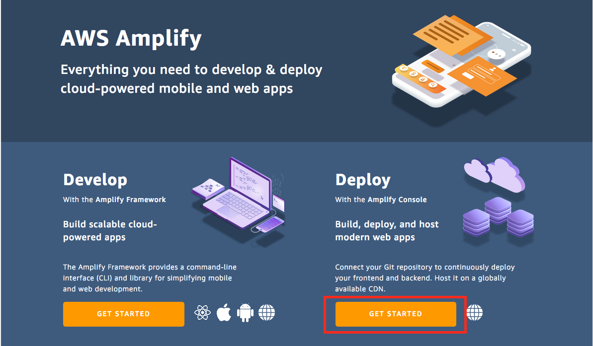
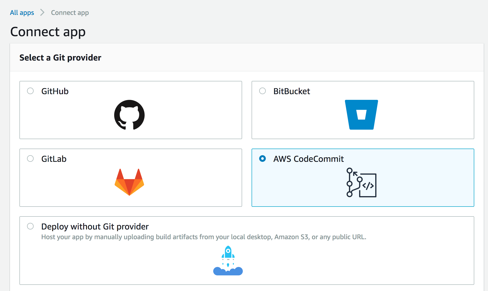
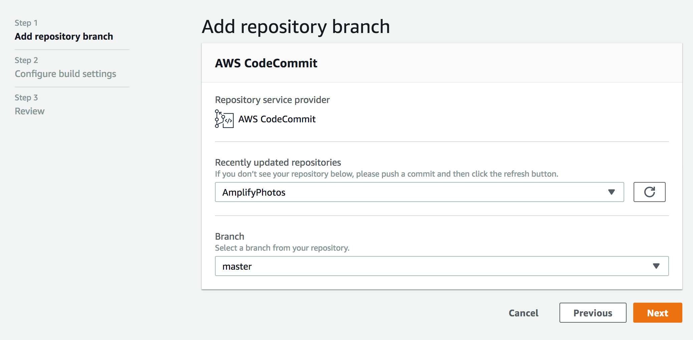
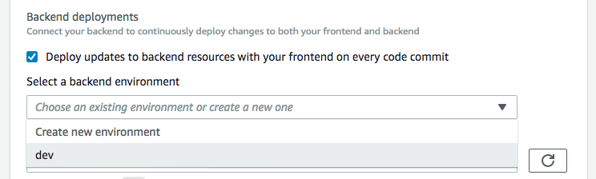
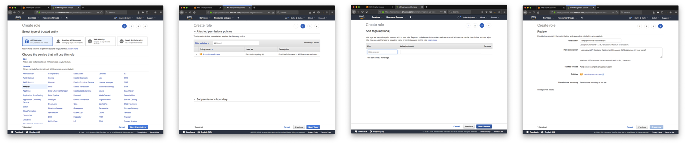
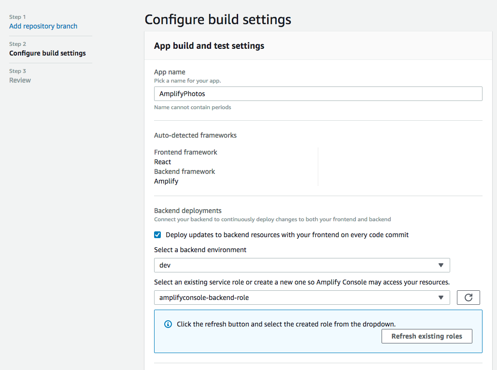
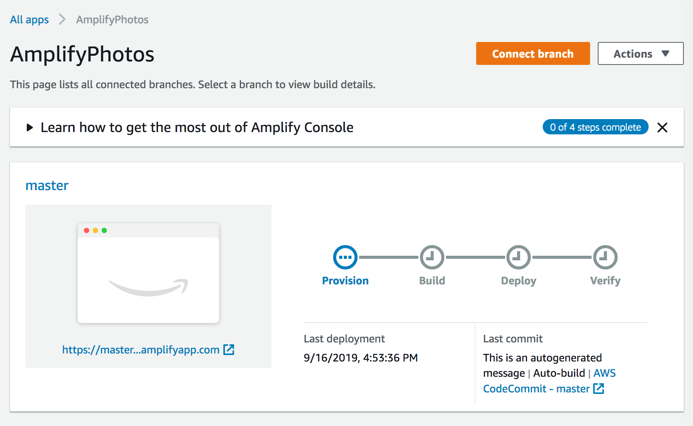
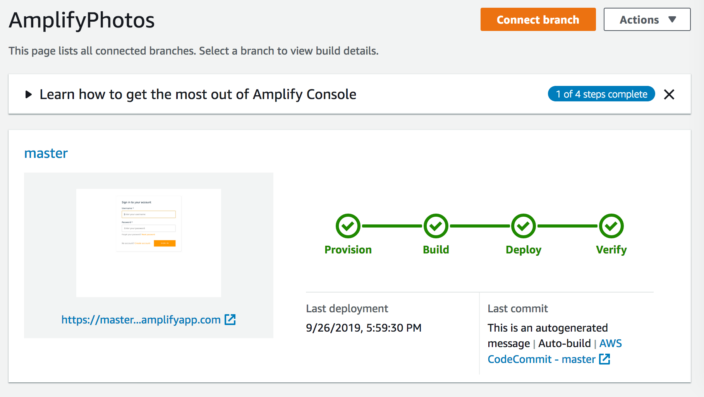

# Build and ship full-stack serverless apps with AWS Amplify

## Hosting

At this point, we have a minimal viable product, complete with authentication, storage, and a flexible API. Amplify also provides a Git-based workflow for deploying and hosting fullstack serverless web applications via [Amplify Console](https://aws.amazon.com/amplify/console/).

In this module, we will create a Git repository to manage application source code and deploy the application using Amplify Console. Amplify Console supports several different Git-based repositories as well as manual deploys. For this workshop, we will use [AWS CodeCommit](https://aws.amazon.com/codecommit/).

To get started, we will create a new CodeCommit repostiory and [Git credentials](https://aws.amazon.com/blogs/devops/introducing-git-credentials-a-simple-way-to-connect-to-aws-codecommit-repositories-using-a-static-user-name-and-password/) to access the service. Enter the following commands in the second terminal (you should be in the `amplify-photos` directory) tab to create the repository and commit the project to source control:

``` bash
git config --global credential.helper '!aws codecommit credential-helper $@'
```

```bash
git config --global credential.UseHttpPath true
```

```bash
export REPO=$(aws codecommit create-repository --repository-name AmplifyPhotos \
        --repository-description "reInvent 2019 - MOB303" \
        --query 'repositoryMetadata.cloneUrlHttp' \
        --output text)
```

```bash
git remote add origin $REPO
```

```bash
git add .
```

```bash
git commit -m "Initial commit"
```

```bash
git push origin master
```

Next, navigate to [Amplify Console](https://console.aws.amazon.com/amplify/home) and click the "Get Started" button under Deploy.



Select CodeCommit and click "Continue".



Select your newly created repository (AmplifyPhotos) and branch (master). Click "Next".



We need to make two changes to the default build settings, both in the __Existing Amplify backend detected__ section. First, for the backend "Select a backend environment" select "dev".



Second, if you have not used Amplify Console before, we need to create a new service role. Click the "Create new role" button. A new tab titled "Create role" will open. Follow the Role creation flow as shown in the following screens, clicking on the blue button in the lower corner on each step (accept default selections):



Back in Amplify Console, the screen should look like the following (you may need to refresh the role listing).



Click "Next" at the bottom of the page.

Review the settings and click "Save and Deploy."



After several minutes, Amplify will have deployed the build and provided a link to view the application. Amplify also generates screenshots of the application on various sized mobile devices at the bottom of the page. Take a moment to review the application and screenshots.

> Our deployment uses the same cloud resources and data as we have used for development. In a real-world scenario, we could use Amplify's support for [multiple environments](https://aws.amazon.com/blogs/mobile/amplify-adds-support-for-multiple-environments-custom-resolvers-larger-data-models-and-iam-roles-including-mfa/) to create separate sets of cloud resources for production and other environments.



In the next module, we will enhance the photo picker to utilize machine learning.

**[Adding Machine Learning >>](../6_MachineLearning)**
