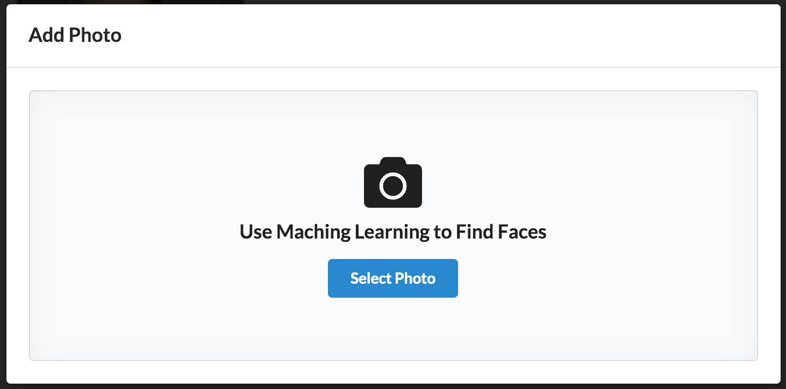

# Build and ship full-stack serverless apps with AWS Amplify

## Machine Learning

In this module, we will use Machine Learning to enhance the application's photo picker. Until now, the application has uploaded the image to S3 immediately on selection. Here, we extend the photo picker to find celebrity faces in the image prior to upload.

To get started, add the [Amplify Predictions](https://aws-amplify.github.io/docs/js/predictions) module to the project. When adding Predictions, Amplify will also utilize the Auth module to autorize the application to perform the required actions.

``` bash
amplify add predictions
```

* Please select from one of the categories below __Identify__
* What would you like to identify? __Identify Entities__
* Provide a friendly name for your resource __ACCEPT DEFAULT VALUE PROVIDED__
* Would you like use the default configuration? __Advanced Configuration__
* Would you like to enable celebrity detection? __Yes__
* Would you like to identify entities from a collection of images? __No__
* Who should have access? __Auth users only__

> Want to make this application more personal? Experiment with identifying entities from a collection of images.

Add Prediction resources in the cloud by entering the following in the second terminal tab (the React dev server should still be running in the first tab from earlier):

``` bash
amplify push
```

The update will take a few minutes, you can proceed while it runs in the background.

To use the Predictions module, we need to add the plug-in to our React application. Open `src/index.js` and modify as follows:

``` diff
import Amplify from 'aws-amplify';
+ import { AmazonAIPredictionsProvider } from '@aws-amplify/predictions';
import awsconfig from './aws-exports';
Amplify.configure(awsconfig);
+ Amplify.addPluggable(new AmazonAIPredictionsProvider());
```

Next, create a new file at `src/MLPhotoPickerModal.js` and paste the following in the new file. The code defines several new React components that will enhance the photo picker we used earlier. This code is primarily user interface, we will implement the image recognition feature shortly.

__src/MLPhotoPickerModal.js__

``` js
import React, { useEffect, useReducer, useRef, useState } from 'react';
import { Button, Dimmer, Divider, Grid, Header, Icon, List, Loader, Modal, Segment } from 'semantic-ui-react';
import Predictions from '@aws-amplify/predictions';

function PhotoPicker(props) {
  const fileInput = useRef(null);

  function handleInput(e) {
    const file = e.target.files[0];
    if (!file) { return; }

    const { name, size, type } = file;
    console.log(`Selected file ${name}`);

    const { onPick } = props;
    if (onPick) {
      onPick({ file, name, size, type });
    }
  }

  return (
    <Segment placeholder>
      <Header icon>
        <Icon name='photo'/>
        Use Maching Learning to Find Faces
      </Header>
      <Button primary onClick={ (e) => fileInput.current.click() }>Select Photo</Button>
      <input ref={ fileInput } title='Pick a photo'
            type="file"
            hidden
            accept='image/*'
            onChange={ handleInput }/>
    </Segment>
  );
};

function ResultPane(props) {
  let { imageSrc, onUpload } = props;
  const [ isAnalyzing, setIsAnalyzing ] = useState(false);
  const [ celebrities, setCelebrities ] = useState([]);
  const [ boundingBoxes, setBoundingBoxes ] = useState([]);

  useEffect(() => {
    identify(props.file);
  }, [props.file]);

  async function identify(file) {
    // TODO: Add Machine Learning
  }

  function upload() {
    if (onUpload) {
      onUpload();
    }
  }

  return (
    <Grid columns={ 2 }>
      <Grid.Row>
        <Grid.Column>
          <ImagePreview src={ imageSrc }
                isAnalyzing={ isAnalyzing }
                boundingBoxes={ boundingBoxes }/>
        </Grid.Column>
        <Grid.Column>
          <Header as='h3'>Celebrities</Header>
          <List bulleted>
            { celebrities.map((c, i) => (
              <List.Item key={ i }>{ c }</List.Item>
            )) }
          </List>

          <Divider/>

          <div>
            <Button primary onClick={ upload }>Upload</Button>
          </div>
          
        </Grid.Column>
      </Grid.Row>
    </Grid>

  );
};

function ImagePreview(props) {
  const { isAnalyzing } = props;

  return (
    <Segment>
      <Dimmer.Dimmable dimmed={ isAnalyzing }>
        <CanvasImage src={ props.src } boundingBoxes={ props.boundingBoxes }/>
        <Dimmer active={ isAnalyzing }>
          <Loader>Analyzing...</Loader>
        </Dimmer>
      </Dimmer.Dimmable>
    </Segment>
  );
};


function CanvasImage(props) {
  const { src, boundingBoxes } = props;
  const canvas = useRef(null);
  const image = useRef(null);

  useEffect(() => {
    const cnvs = canvas.current;
    const ctx = cnvs.getContext('2d');
    const img = image.current;

    img.addEventListener('load', e => {
      ctx.drawImage(img, 0, 0); // firefox likes this
    });

    ctx.clearRect(0, 0, cnvs.width, cnvs.height);
    ctx.drawImage(img, 0, 0); // chrome seems to prefer this approach
  }, [src]);

  useEffect(() => {
    const cnvs = canvas.current;
    const ctx = cnvs.getContext('2d');
    const img = image.current;

    if (!boundingBoxes) { return; }

    boundingBoxes.forEach((box) => {
      ctx.beginPath();
      ctx.lineWidth = '3';
      ctx.strokeStyle = 'red';
      ctx.rect(box.left * img.width,
          box.top * img.height,
          box.width * img.width,
          box.height * img.height);
      ctx.stroke();
    });
  }, [boundingBoxes]);

  return (
    <div className="image content">
      <div className="ui medium image">
        <canvas ref={ canvas } width={300} height={300}/>
        
      </div>
    </div>
  );
};

function MLPhotoPicker(props) {
  const { open, onClose, onPick, trigger } = props;

  const initalState = {
    src: '',
    file: null,
    data: null
  };

  const [state, dispatch] = useReducer(reducer, initalState);

  function reducer(state, action) {
    switch(action.type) {
      case 'setFile':
        return { ...state, file: action.file, data: action.data }
      case 'setSrc':
        return { ...state, src: action.url }
      case 'reset':
        return initalState;
      default:
        new Error();
    }
  }

  function handlePick(data) {
    const { file } = data;
    dispatch({ type: 'setFile', file, data });

    const reader = new FileReader();
    reader.onload = function(e) {
      const url = e.target.result;
      dispatch({ type: 'setSrc', url });
    };
    reader.readAsDataURL(file);
  }

  function handleClose() {
    dispatch({ type: 'reset' })
    if (onClose) {
      onClose(); // follow through with parent onClose 
    }
  }

  function doUpload() {
    if (onPick) {
      onPick(state.data);
    }
    dispatch({ type: 'reset' })
  }

  return (
    <Modal size='small' closeIcon trigger={ trigger } open={ open } onClose={ handleClose }>
      <Modal.Header>Add Photo</Modal.Header>
      <Modal.Content image>        
        <Modal.Description>
          { state.src ? (
            <ResultPane imageSrc={ state.src } file={ state.file } onUpload={ doUpload }/>
          ) : (
            <PhotoPicker onPick={ handlePick } />
          )}
        </Modal.Description>
      </Modal.Content>
    </Modal>
  );
}

export default MLPhotoPicker;
```

Next, modify `src/AlbumDetail.js` in two places to reference the new component. At the top of the file:

``` diff
import { S3Image } from 'aws-amplify-react';
import awsconfig from './aws-exports';
import uuid from 'uuid/v4';

+ import MLPhotoPickerModal from './MLPhotoPickerModal';
```

Then at the bottom of the file (you can safely ignore any unused warnings):

``` diff
return state.isLoading ? (
    <p>loading...</p>
  ) : (
    <div>
-      <Modal size='small' closeIcon
-             open={openModal}
-             onClose={() => { showModal(false) }}
-             trigger={<Button primary floated='right' onClick={() => {showModal(true) }}>Add Photo</Button>}>
-        <Modal.Header>Upload Photo</Modal.Header>
-        <Modal.Content>
-          { state.message }
-          <PhotoPicker preview onPick={(data) => createPhoto(data, state, dispatch)} />
-        </Modal.Content>
-      </Modal>
+      { user && user.username === state.album.owner &&
+        <MLPhotoPickerModal
+            open={openModal}
+            onClose={() => { showModal(false) }}
+            trigger={ <Button primary floated='right' onClick={() => { showModal(true) }}>Add Photo</Button> }
+            onPick={ (data) => {
+              showModal(false);
+              createPhoto(data, state, dispatch);
+            }} /> }

      <Header as='h1'>{ state.album.name }</Header>

      <PhotoGrid photos={ state.photos } />
    </div>
  );
```

Save your changes.

Return to the application preview / React development server. Click on an album and then the "Add Photo" button to see the new photo picker (note that the picker is not fully functional yet):



Next, let's add machine learning to the photo picker. In `src/MLPhotoPickerModal.js`, find the comment `// TODO: Add Machine Learning` in the `ResultPane` component. Replace the comment with the following code. Here, we are using the Amplify Predictions module to identify entities, specifically celebrity faces, in the uploaded photo.

``` js
  if (!file) { return; }

  setIsAnalyzing(true);

  try {
    // Use the Amplify Predictions model to identify entities in the photo
    let result = await Predictions.identify({
      entities: {
        source: {
          file
        },
        celebrityDetection: true
      }
    });

    const entities = result.entities;
    let celebs = [];
    let boxes = [];

    // For each found entity, capture celebrity name and face bounding box
    entities.forEach(({ boundingBox, metadata: { name='' } }) => {
      if (boundingBox) { boxes.push(boundingBox); }
      if (name) { celebs.push(name); }
    });

    setBoundingBoxes(boxes);
    setCelebrities(celebs);
  } catch (error) {
    console.error('[identify] ', error);
  }

  setIsAnalyzing(false);
```

Save the file and refresh the page. Then download one of the sample photos from in the [celebs](./celebs) directory to your laptop.

Click "Add Photo" again. Select the photo and wait for Rekognition to complete its analysis. Once finished, the new, machine learning-powered photo picker will display the celebrity's name and draw a bounding box around his or her face. Click the "Upload" button to add the celebrity photo to your photo album.


For today's workshop, the photo picker was tuned to identify celebrities, but you could also modify the application to identify family member or friends faces as well. To learn more about the changes required, check [Amplify documentation](https://aws-amplify.github.io/docs/js/predictions).

Before moving on, let's commit our updates to source control. As we previously configured Amplify Console, the commit will trigger an update to the site within a few minutes. Enter the following in the second terminal tab:

``` bash
git add .
```

``` bash
git commit -m "Add machine learning photo picker"
```

``` bash
git push origin master
```

In the next module, we will add analytics to measure usage of our application.

**[Adding Analytics >>](../7_Analytics)**
