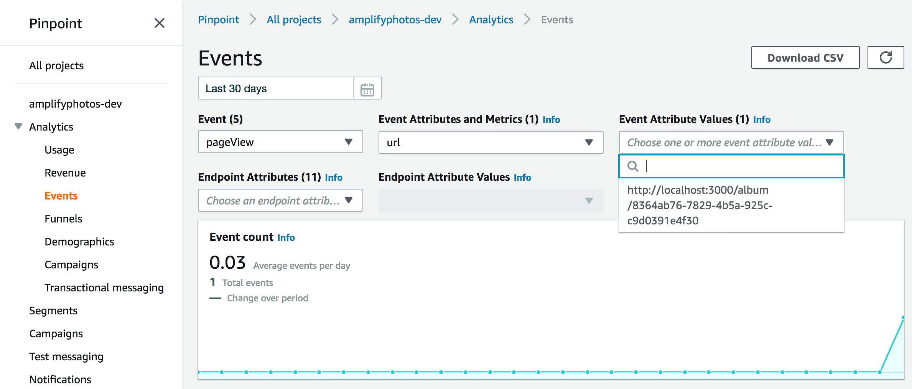
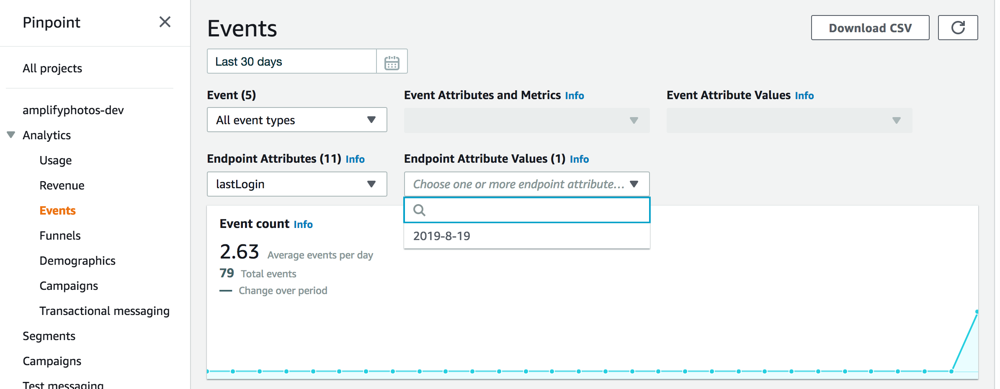

# Build and ship full-stack serverless apps with AWS Amplify

## Analytics

Understanding and engaging your customers is an important aspect of all digital properties. In this module, we will add the [Amplify Analytics](https://aws-amplify.github.io/docs/js/analytics) module powered by [Amazon Pinpoint](https://aws.amazon.com/pinpoint/) to measure user engagement.

To get started, add the Analytics module:

``` bash
amplify add analytics
```

* Provide your pinpoint resource name: __amplifyphotos__
* Apps need authorization to send analytics events. Do you want to allow guests and unauthenticated users to send analytics events? __Yes__

Next, push your updates to the cloud:

``` bash
amplify push
```

As noted earlier, Amplify will provide a review of the changes to your cloud resources. In this case, the Analytics module will be created and the Auth module updated (to allow for unauthenticated use of Pinpoint services). The output should look like the following:

``` bash
| Category    | Resource name            | Operation | Provider plugin   |
| ----------- | ------------------------ | --------- | ----------------- |
| Analytics   | amplifyphotos            | Create    | awscloudformation |
| Auth        | amplifyphotosabcde123    | Update    | awscloudformation |
| Storage     | AmplifyPhotoStorage      | No Change | awscloudformation |
| Api         | AmplifyPhotosApi         | No Change | awscloudformation |
| Function    | AmplifyPhotoProcessor    | No Change | awscloudformation |
| Predictions | identifyEntitiesccd20a09 | No Change | awscloudformation |
```

Then enter 'Y' at the prompt to continue. The update will take a few minutes, feel free to carry on while Amplify works in the background.

With the Amplify Analytics module, we can use Pinpoint to track sessions, page views, and other usage information. Session tracking will be automatically enabled by Amplify. This means that the start of each session will be indicated by a `_session_start` event in Pinpoint and a user sign-in to our application by a `_userauth.sign_in` event.

Amplify also makes it simple to add page view tracking to the application. Let's enable tracking by modifying `src/index.js` in two locations. First, import the Amplify Analytics module:

``` diff
- import Amplify from 'aws-amplify';
+ import Amplify, { Analytics } from 'aws-amplify';
```

Next, enable page view auto tracking. Note that we need to set the tracking type to `SPA` for single-page applications, such as this one.

``` diff
Amplify.configure(awsconfig);
Amplify.addPluggable(new AmazonAIPredictionsProvider());
+ Analytics.autoTrack('pageView', { enable: true, type: 'SPA' });
```

Save the file. Click around in the application a little. The application is now collecting page view metrics in Pinpoint. After a few minutes, we can view the metrics in the Pinpoint console in the Events tab. To access the Pinpoint console, click on the link found in the last line of the `push` output or navigate to Pinpoint via the AWS Console menu, selecting the project "amplifyphotos-dev".

In the Pinpoint console, we can view the page views for a given URL on the Events tab by selecting the `pageView` event as shown below:



Pinpoint also offers powerful capabilities to send targeted messages (email, SMS, push notifications, etc.) based on usage or user attributes. From the application, we can associate usage or other attributes with the user's endpoint (i.e. email address, phone number) via the `updateEndpoint` method.

In our application, users provide a validated email address as part of account creation. We will update the application to retrieve the current user's email address on each sign-in event and update the endpoint. This requires two changes to `src/useAmplifyAuth.js` as shown below. First, import the Amplify Analytics module.

``` diff
- import { Auth, Hub } from 'aws-amplify';
+ import { Analytics, Auth, Hub } from 'aws-amplify';
```

Next, modify the `onAuthEvent` method to call `updateEndpoint` when a sign in occurs. Here, we will update the current Pinpoint endpoint to include the user's email address and unique user identifier. We will also include today's date as a user attribute called `lastLogin` as shown below:

``` diff
-    const onAuthEvent = (payload) => {
+    const onAuthEvent = async (payload) => {
      switch(payload.event) {
        case 'signIn':
+          const { data: { attributes }} = payload;
+          const now = new Date();
+          await Analytics.updateEndpoint({
+            address: attributes.email,
+            channelType: "EMAIL",
+            optOut: "NONE",
+            userId: attributes.sub,
+            userAttributes: {
+              lastLogin: [ `${now.getFullYear()}-${now.getMonth()+1}-${now.getDate()}` ]
+            }
+          });

          // on signin, we want to rerun effect, trigger via flag
          if (isMounted) { setFetchTrigger(true); }
          break;
```

Including user attributes such as interests or last login date can be useful in both targeted messaging and better understanding your users. We could, for example, use last login date to identify and message users who have not logged in over the past 30 days. This is a powerful approach to re-engage users or reward users who use the application often.

After saving your updates, click the "Sign Out" link in the upper right corner of the application. You should now see the authentication form we created in the Authentication module. Login using the credentials you created earlier.

Wait a few minutes and then return to the Events tab in the Pinpoint console. Refresh the page. In the "Endpoint Attributes" dropdown, you should now see a User Attribute called lastLogin. Selecting it, the available value in the next drop down to the right should be today's date.



While outside the scope of this workshop, Pinpoint User Attributes can be used to build segments and dynamic engagement campaigns across a variety of channels. Visit the [Pinpoint](https://aws.amazon.com/pinpoint/) website to learn more.

In the next module, we will add album sharing.

**[Advanced >>](../8_Advanced)**