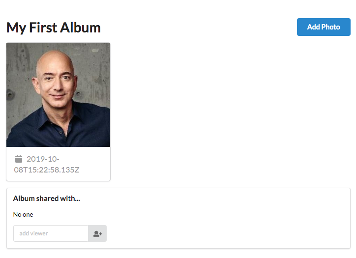

# Build and ship full-stack serverless apps with AWS Amplify

## Sharing Photos

One of the joys of photos is the ability to share with friends and loved ones. In this module, we will further enhance the photo album application to support sharing albums with other users.

To get started, we will revise the authorization rules for the `Album` object in our GraphQL schema. As you may have noticed in the Trigger module, Amplify supports multiple authorization rules on a single object. To enable sharing, we will add a new field, "viewers" to the object and add an authorization rule that provides read permission.

Open `amplify/backend/api/AmplifyPhotosApi/schema.graphql` and modify as follows:

``` diff
type Album
  @model
-  @auth(rules: [{ allow: owner }])
+ @auth(
+   rules: [
+     { allow: owner },
+     { allow: owner, ownerField: "viewers", operations: [ read ] }  
+   ]
+ )
{
  id: ID!
  owner: ID!
  ownerId: String!
+   viewers: [String]
  name: String!
```

While the above adds an authorization check that allows viewers to access albums, they are not yet able to view the photos in those albums. To authorize viewers to read photos, we will use an Amplify escape hatch. We need to change the behavior of the `Album.photos` resolver, specifically its response. To do so, create a new file `amplify/backend/api/AmplifyPhotosApi/resolvers/Album.photos.res.vtl` and paste the following contents into the file. When we use the `amplify push` shortly, the custom resolver defined here will be used instead of the auto-generated one.

### Album.photos.res.vtl

``` vtl
## [Start] Determine request authentication mode **
#if( $util.isNullOrEmpty($authMode) && !$util.isNull($ctx.identity) && !$util.isNull($ctx.identity.sub) && !$util.isNull($ctx.identity.issuer) && !$util.isNull($ctx.identity.username) && !$util.isNull($ctx.identity.claims) && !$util.isNull($ctx.identity.sourceIp) && !$util.isNull($ctx.identity.defaultAuthStrategy) )
  #set( $authMode = "userPools" )
#end
## [End] Determine request authentication mode **
## [Start] Check authMode and execute owner/group checks **
#if( $authMode == "userPools" )
  ## No Static Group Authorization Rules **


  ## [Start] If not static group authorized, filter items **
  #if( ! $isStaticGroupAuthorized )
    #set( $items = [] )
    #foreach( $item in $ctx.result.items )
      ## No Dynamic Group Authorization Rules **


      ## [Start] Owner Authorization Checks **
      #set( $isLocalOwnerAuthorized = false )
      ## Authorization rule: { allow: owner, ownerField: "owner", identityClaim: "cognito:username" } **
      #set( $allowedOwners0 = $item.owner )
      #set( $identityValue = $util.defaultIfNull($ctx.identity.claims.get("username"), $util.defaultIfNull($ctx.identity.claims.get("cognito:username"), "___xamznone____")) )
      #if( $util.isList($allowedOwners0) )
        #foreach( $allowedOwner in $allowedOwners0 )
          #if( $allowedOwner == $identityValue )
            #set( $isLocalOwnerAuthorized = true )
          #end
        #end
      #end
      #if( $util.isString($allowedOwners0) )
        #if( $allowedOwners0 == $identityValue )
          #set( $isLocalOwnerAuthorized = true )
        #end
      #end
      ## Authorization rule: { allow: owner, ownerField: "viewers", identityClaim: "cognito:username" } **
      ## ADDED: Look at the viewers of the parent (album) object
      #set( $allowedOwners1 = $ctx.source.viewers )
      #set( $identityValue = $util.defaultIfNull($ctx.identity.claims.get("username"), $util.defaultIfNull($ctx.identity.claims.get("cognito:username"), "___xamznone____")) )
      #if( $util.isList($allowedOwners1) )
        #foreach( $allowedOwner in $allowedOwners1 )
          #if( $allowedOwner == $identityValue )
            #set( $isLocalOwnerAuthorized = true )
          #end
        #end
      #end
      #if( $util.isString($allowedOwners1) )
        #if( $allowedOwners1 == $identityValue )
          #set( $isLocalOwnerAuthorized = true )
        #end
      #end
      ## [End] Owner Authorization Checks **


      #if( ($isLocalDynamicGroupAuthorized == true || $isLocalOwnerAuthorized == true) )
        $util.qr($items.add($item))
      #end
    #end
    #set( $ctx.result.items = $items )
  #end
  ## [End] If not static group authorized, filter items **
#end
## [End] Check authMode and execute owner/group checks **

#if( !$result )
  #set( $result = $ctx.result )
#end
$util.toJson($result)
```

Next, push the updates to the API to the cloud by entering the `push` command and following the prompts:

``` bash
amplify push
```

* Are you sure you want to continue? __Yes__
* Do you want to update code for your updated GraphQL API __Yes__
* Do you want to generate GraphQL statements (queries, mutations and subscription) based on your schema types? This will overwrite your current graphql queries, mutations and subscriptions __Yes__

While Amplify performs updates, feel free to move on.

To enable sharing in the React application, we need to make several changes in `src/AlbumDetail.js` and adjust the `getAlbum` query.

First, open `src/graphql/queries.js` and modify the `getAlbum` query as shown below, then save the file:

``` diff
export const getAlbum = `query GetAlbum($id: ID!) {
  getAlbum(id: $id) {
    id
    owner
    ownerId
+    viewers
    name
```

Next, modify the imports at the top of the file to import several new UI components.

``` diff
import React, { useEffect, useState, useReducer } from 'react';
- import { Button, Card, Header, Icon, Image, Message, Modal } from 'semantic-ui-react';
+ import { Button, Card, Header, Icon, Image, Input, Loader, Message, Segment } from 'semantic-ui-react';
import { API, Storage, graphqlOperation } from 'aws-amplify';
- import { S3Image, PhotoPicker } from 'aws-amplify-react';
+ import { S3Image } from 'aws-amplify-react';
import awsconfig from './aws-exports';
import uuid from 'uuid/v4';

import MLPhotoPickerModal from './MLPhotoPickerModal';

import { getAlbum as getAlbumQuery } from './graphql/queries';
import { createPhoto as createPhotoMutation } from './graphql/mutations';
+ import { updateAlbum as updateAlbumMutation } from './graphql/mutations';
```

To enable sharing, we need to know the identity of the currently logged in user. We use a React Context to pass this detail in from `src/App.js` as a property.

At the bottom of the file, add a new `AlbumSharing` component just before the last line, which reads `export default AlbumDetail`. This component will display a simple control that allows the owner of an album to add viewers by name.

``` js
function AlbumSharing(props) {
  const [newUser, setNewUser] = useState('');
  const [isLoading, setIsLoading] = useState(false);

  async function addMember() {
    setIsLoading(true);
    const inputData = {
      id: props.album.id,
      viewers: [ ...props.album.viewers || [], newUser ]
    };

    const result = await API.graphql(graphqlOperation(updateAlbumMutation, { input: inputData }));
    console.log(`${newUser} is now a viewer of album ${result.data.updateAlbum.id}`);
    setNewUser('');
    setIsLoading(false);
  };

  return (
    <Segment size='small'>
      <Header as='h4'>Album shared with...</Header>
      <p>
      { props.album.viewers ? props.album.viewers.join(', ') : 'No one' }
      </p>

      <Input placeholder='add viewer'
        size='small'
        disabled={isLoading}
        action={{ icon: 'user add', onClick: addMember }}
        onChange={ e => setNewUser(e.target.value) }
        value={ newUser } />
      <span style={{ 'paddingLeft': '1rem' }}>
        <Loader active={isLoading} inline size='small'/>
      </span>
    </Segment>
  );
}
```

We can incoporate the new component in the `AlbumDetail` component as follows. Again, we will only display this widget for the album owner. We will also pass the Amazon Cognito `identityId` (a unique identifier for the user) for the album owner to the `PhotoGrid`.

``` diff
<Header as='h1'>{ state.album.name }</Header>
{ state.message &&
    <Message><p>{ state.message }</p></Message> }
- <PhotoGrid photos={ state.photos } />
+ <PhotoGrid photos={ state.photos } owner={ state.album.ownerId } />

+ { user && user.username === state.album.owner &&
+     <AlbumSharing album={ state.album } />}
```

Finally, we need to modify the two components responsible for displaying photos in an album. First, in the `PhotoGrid` component, add an owner property as follows. This will pass the unique identifier for the owner as a property to a child component, `PhotoCard`.

``` diff
function PhotoGrid(props) {
  return (
    <Card.Group itemsPerRow={3}>
      {
        props.photos.map((photo, i) => (
-          <PhotoCard key={ i } photo={ photo } />
+          <PhotoCard key={ i } photo={ photo } owner={ props.owner } />
        ))
      }
    </Card.Group>
  );
}
```

Then, in the `PhotoCard` component, we add an `identityId` property to the `S3Image` component provided by Amplify. The `identityId` is a unique identifier for the album owner, we need to include it to access that user's photos, which have been stored using a protected IAM policy in the application Amazon S3 bucket.

``` diff
function PhotoCard(props) {
  const [src, setSrc] = useState('');
  const { createdAt, gps, fullsize, thumbnail } = props.photo;

  return (
    <Card>
-      <S3Image hidden level='protected' imgKey={ thumbnail ? thumbnail.key : fullsize.key } onLoad={ url => setSrc(url) } />
+      <S3Image hidden level='protected'
+            identityId={ props.owner || null }
+            imgKey={ thumbnail ? thumbnail.key : fullsize.key }
+            onLoad={ url => setSrc(url) } />
      <Image src={ src } />
      <Card.Content extra>
```

Save `src/AlbumDetails.js` and return to the browser running the React application.

> We have made a lot of changes to `AlbumDetails.js` in this module. If needed, we have included an updated [version of the file](./AlbumDetail.js).

Visit an album detail page and note the new sharing widget towards the bottom of the page, such as:



Next, let's add the name of a second user who will be able to view this album (we'll create the user shortly). Enter the name, for example "bob", and click the add user button. A spinner will appear and then disapper when the action is complete.

Click the "Sign Out" link in the upper right hand corner.

On the "Sign in" screen, click on the "Create new account" link. Create a new user with the name selected earlier (e.g. bob), you can use the same email address as the first account. Follow the prompts to complete account creation and sign in.

After logging in, you should already see an existing album that was shared with the new user. If you click on the album name, you should see the photos that were previously added, but not the sharing widget.


In the next module, we will cleanup our project.

**[Cleanup >>](../9_Cleanup)**
