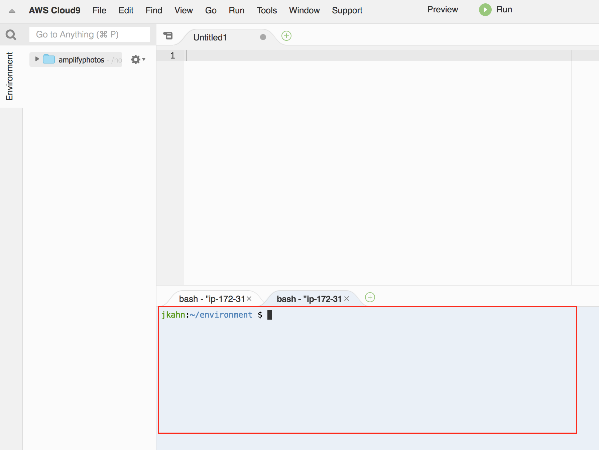

# Build and ship full-stack serverless apps with AWS Amplify

In this workshop, we will learn how to use AWS AppSync and the AWS Amplify Framework to code, build, and deploy engaging full-stack serverless apps in React. The goal for this workshop is to leave with a working photo album application.

### Topics we'll be covering

* Authentication
* GraphQL and AWS AppSync
* Authorization to the AWS AppSync API
* Storage with Lambda Trigger
* Deploying Your Project
* Machine Learning
* Analytics
* Cleaning Up

## Getting Started

[AWS Cloud9](https://aws.amazon.com/cloud9/) is the recommended IDE for this workshop. All directions will assume Cloud9. You will also need administrator access to the target AWS account to provision the various resources required for this workshop.

> If this is your first time working with AWS Cloud9, the [Hello AWS Cloud9](https://docs.aws.amazon.com/cloud9/latest/user-guide/tutorial-create-environment.html) can help you get started.

Create a new Cloud9 environment with the following settings:

* Name: AmplifyPhotos
* Environment Type: EC2
* Instance type: t2.small
* Platform: Amazon Linux
* Cost-saving setting: After one hour

Your Cloud9 environment will be ready in a few minutes. The Cloud9 IDE includes a terminal at the bottom of the browser window, this is where you will be entering the commands used throughout the workshop.



To use Amplify on Cloud9, we need to add a configuration file to specify the default AWS region. Here we specify us-west-2 (Oregon), but you can change as desired. Run the following command in the terminal to create the `~/.aws/config` file necessary to configure Amplify on Cloud9:

``` bash
cat <<END > ~/.aws/config
[default]
region=us-west-2
END
```

## Create React app

To start, create a new React project using the [Create React App CLI](https://github.com/facebook/create-react-app).

``` bash
npx create-react-app amplify-photos
```

> Create React App will setup your development environment and provide the shell of a new single-page React application. It includes a number of helpful tools such as Webpack and Babel.

Next, add the AWS Amplify library, Amplify React components, and other dependencies to your project. The Amplify Framework provides a set of libraries and UI components to integrate AWS cloud services with your JavaScript (React, Vue, Angular, etc.), React Native, iOS, and Android applications.

``` bash
cd amplify-photos

npm install --save aws-amplify aws-amplify-react @reach/router uuid semantic-ui-react semantic-ui-css
```

### Creating a new Amplify Project

We currently have a boilerplate React application, with a few dependencies installed. Next, we will use the AWS Amplify CLI to connect the application to the cloud.

The Amplify CLI allows you to configure all the services needed to power your backend through a simple command line interface. We will use the CLI to quickly configure a number of AWS Resources in this workshop, including AWS AppSync, Lambda, Cognito, and S3. Let's install the CLI (You can safely ignore any deprecation errors and warnings in this step.):

``` bash
npm install -g @aws-amplify/cli
```

Once we have the CLI installed, we can initialize a new Amplify project. The `init` command will setup your local environment and create three cloud resources: (1) IAM role for unauthenticated user, (2) IAM role for authenticated users, and (3) an S3 bucket for deployments. Run the following command and respond to prompts as shown:

``` bash
amplify init
```

* Enter a name for the project: __AmplifyPhotos__
* Enter a name for the environment: __dev__
* Choose your default editor: __None__
* Please choose the type of app that you're building __javascript__
* What javascript framework are you using __react__
* Source Directory Path: __src__
* Distribution Directory Path: __build__
* Build Command: npm run-script __npm run-script build__
* Start Command: npm run-script __npm run-script start__
* Do you want to use an AWS profile? __Y__
* Please choose the profile you want to use: __default__

After initiaization has finished, you will find a new directory named `amplify` in your project as well as a new file named `aws-exports.js` in the `src` directory. The `amplify` directory contains the configuration files for your project. At times throughout this workshop, we will modify these files to demonstrate how to customize your application. The `aws-exports.js` file specifies the cloud resources used by the React application.

You can always check the status of your Amplify project with the `status` command. Here, you will find the state of the cloud resources in the project.

``` bash
amplify status
```

As we have not added resources to the project yet, the `status` command will currently return the following:

``` bash
| Category | Resource name | Operation | Provider plugin |
| -------- | ------------- | --------- | --------------- |
```

### Configuring the React Application

Now that we have started to lay the groundwork for the cloud services used by our application, let's configure the React app to be aware of them. As noted earlier, Amplify has created a new file __aws-exports.js__ in the __src__ directory. This file contains references and details about the cloud services configured in our project. As we add new capabilities to the project, this file will be automatically updated with the appropriate information.

To configure the app, open __src/index.js__ in your IDE and add the following four lines of code just after the last import statement (do not include the '+' signs):

``` diff
import React from 'react';
import ReactDOM from 'react-dom';
import './index.css';
import App from './App';
import * as serviceWorker from './serviceWorker';

+ import 'semantic-ui-css/semantic.min.css'
+ import Amplify from 'aws-amplify'
+ import awsconfig from './aws-exports'
+ Amplify.configure(awsconfig)

ReactDOM.render(<App />, document.getElementById('root'));
```

Save the file. Our app is now connected to AWS services.

### Working with Amplify Command Line Tools

Before moving to the next module, a brief word on working with the Amplify command line tools. Some operations present a multiple choice option such as the one shown below. In these cases, you can use the space bar to select one or more of the options before pressing the enter button to move to the next question. Selected choices will have a filled circle instead of an outline.

``` bash
? Pick one or more of the following options. 
❯◯ not selected 1
 ◉ selected
 ◯ not selected 2
```

Next, we will start to add AWS cloud services to power our photo album application:

**[Adding Authentication >>](./1_Auth)**
